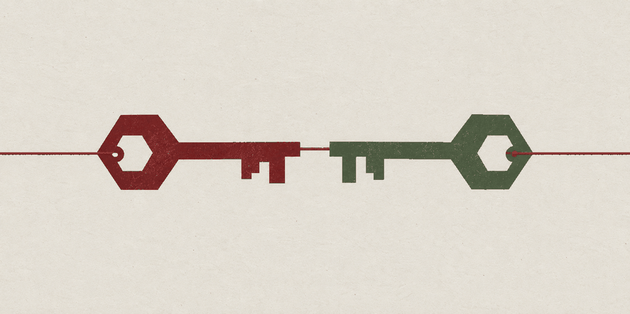
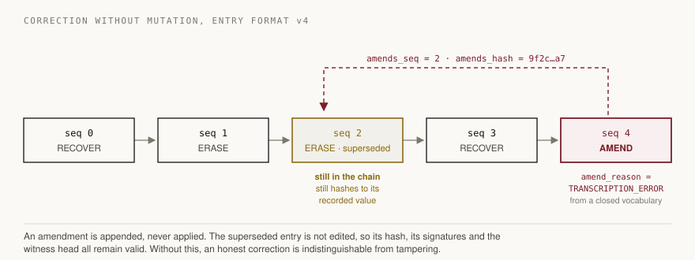
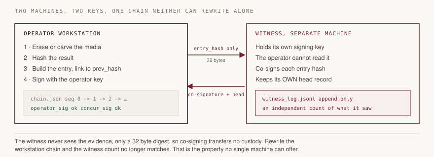
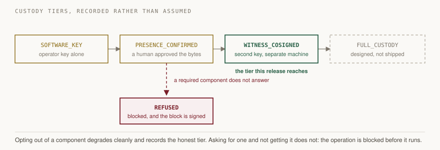
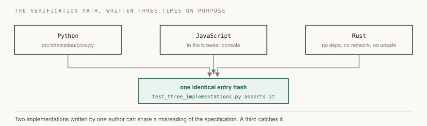

# Akhanda

**अखण्ड, "unbroken"**

A forensic tool for secure data erasure and file recovery, where every operation is
written into a single append-only ledger that two independent parties sign, and the
certificate it produces satisfies both NIST SP 800-88 Rev. 2 and Section 63(4) of the
Bharatiya Sakshya Adhiniyam, 2023.

Built by **Team Syntax Squad**, GITAM (Deemed to be University), Hyderabad, for **Smart
India Hackathon 2026**, problem statement **SIH26149**, sponsored by the **National
Technical Research Organisation (NTRO)**.

The complete, independent work of six team members. Released publicly under Apache-2.0 so
that a tool built for verifiability can itself be verified. See [Authorship](#authorship).

<p align="center">
  
</p>

**Topics:** `digital-forensics` `chain-of-custody` `data-erasure` `file-carving`
`nist-800-88` `bharatiya-sakshya-adhiniyam` `ed25519` `hash-chain` `sih2026` `sih26149`
`ntro` `python` `rust`

---

## The problem this solves

Every forensic tool on the market signs each certificate on its own. That proves a single
document was not edited after the fact. It does not prove the record is complete.

Take one certificate out of the middle of a case file and every remaining certificate
still verifies perfectly. Nothing records that the missing one ever existed. Auditing a
pile of individually valid PDFs cannot tell you whether the pile is whole.

Akhanda links operations into one chain, where each entry commits to the hash of the entry
before it. Remove an entry and every later link breaks, and verification reports the exact
sequence number where the break occurred. A second party on a physically separate machine
co-signs the same entry hash, so no single operator can rebuild the record alone. When a
required component does not answer, the tool refuses to run and writes the refusal into
the chain rather than quietly producing a weaker result.

Run `akhanda/scripts/demo_tamper.py` to see all three properties demonstrated in about
ninety seconds.

---

## Results

Every figure below was produced by running the code in this repository. Commands to
reproduce each one are given in the sections that follow.

### Test suite

| Measure | Result |
|---|---|
| Tests | 648 |
| Passed | 648 |
| Failed | 0 |
| Errors | 0 |
| Runtime | 67.5 s |

Counted from the JUnit XML report rather than the progress output, because progress
characters are unreliable when a run is parametrised.

### Chain verification

The round one chain, frozen before this release, re-verified by the independent Rust
implementation:

```
chain    : 05d05a01761a35ba  (3 entries)
result   : VERIFIED, chain verified
operator : 3 of 3 signature(s) re-verified
exit code: 0
```

### Dual signature, exercised against a live witness node

| Property | Observed |
|---|---|
| Custody tier reached | `WITNESS_COSIGNED` |
| Operator signatures re-verified | 1 of 1 |
| Concurring signatures re-verified | 1 of 1 |
| Witness agreement | witness head agrees over 1 co-signed entry |
| Certificate | BSA Part A and Part B signature blocks both populated |

### Refusal behaviour

With the co-signer unreachable and no explicit opt-out, the operation is stopped before it
begins:

```
preflight: BLOCKED, witness co-signer unavailable;
           required WITNESS_COSIGNED, only SOFTWARE_KEY reachable
refusal  : recorded as entry seq 1 (op_type REFUSED)
NOTHING was read, written, or destroyed on the target.
exit code: 3
```

The refusal is a signed entry in the chain. Unplugging the co-signer logs the attempt
instead of hiding it.

### Carving, measured against NIST CFReDS

The NIST Computer Forensic Reference Data Set is published by a third party with known
ground truth, so a carver can be measured rather than trusted.

| Image | Artefacts present | Reported | Exact | Precision | Recall |
|---|---|---|---|---|---|
| L3_Graphic.dd | 0 | 2 | 0 | 0.0% | n/a |
| L4_Graphic.dd | 3 | 5 | 2 | 40.0% | 66.7% |

These numbers are modest and are published as they are. The thresholds in the test suite
are set at what the carver actually achieves, so any change that lowers precision or
recall fails the build.

On L2_Graphic.dd, where no file is stored contiguously, the signature carver correctly
recovers nothing. Reassembly then recovers the file whole:

```
artefact size          : 12,966,639 bytes
reassembled sha256     : 9779c1ee5174f00f7d4130204c506a0e65d0be02d12d54ba2800f632ff95ca5b
NIST published sha256  : 9779c1ee5174f00f7d4130204c506a0e65d0be02d12d54ba2800f632ff95ca5b
result                 : byte identical to NIST 000_0021.png
```

Assembled from 2 fragments across 1,584 chunks, every one validated by its own CRC-32. The
join is proven by the PNG format's own checksums, not accepted because a decoder tolerated
the file.

---

## Repository layout

```
akhanda/        Python core, Rust verifier, 648 tests, documentation
frontend/       React and Vite console, with the tamper demonstration
console-app/    static viewer, no build step required
witness/        the co-signer node: one file, three dependencies
demo-data/      output from an actual run: chain, certificate, proofs
```

---

## Getting started

```bash
cd akhanda
pip install -r requirements.txt
export PYTHONPATH=src           # Windows: set PYTHONPATH=src

python -m pytest tests/ -q      # 648 tests
python scripts/demo_tamper.py   # the demonstration described above
```

Then open `console-app/index.html` in a browser. It re-verifies the chain client side with
no server running.

### Command line

```bash
export PYTHONPATH=src

python -m cli init                                   # create the operator key and chain
python -m cli recover evidence.dd --out recovered/   # carve, hash, record
python -m cli erase disk.img                         # erase, verify, record
python -m cli verify                                 # chain and both signatures
python -m cli certify --out certificates/ \
       --operator "J. Rao" --expert "K. Singh"       # NIST and BSA certificate
python -m cli show                                   # print the chain
```

Requesting a component makes it required. If it does not answer and you did not opt out,
the operation is blocked and the attempt is recorded:

```bash
python -m cli recover evidence.dd                 # blocked if the co-signer is silent
python -m cli --no-witness recover evidence.dd    # deliberate: run at a lower tier
python -m cli --allow-degraded recover e.dd       # deliberate: proceed anyway
```

Custody tiers degrade in a way that is recorded rather than assumed: `SOFTWARE_KEY`,
`PRESENCE_CONFIRMED`, `WITNESS_COSIGNED`, `FULL_CUSTODY`.

Erasing a real block device requires two independent gates, deliberately:

```bash
AKHANDA_ALLOW_DEVICE_WRITE=1 python -m cli erase /dev/sdb \
    --confirm I-UNDERSTAND-THIS-DESTROYS-DATA
```

### The witness node

The co-signer runs on a separate machine. That separation is the point of the design.

```bash
cd witness
pip install -r requirements.txt
python node.py                  # serves on port 8000
```

Point the workstation at it:

```bash
python -m cli --witness http://<witness-ip>:8000 recover evidence.dd
```

### The console

```bash
cd frontend
npm install
npm run build
```

---

## Three independent verifiers

The verification path is implemented three times, in Python, in JavaScript inside the
console, and in Rust. A test asserts that all three produce identical entry hashes. Two
implementations written by one author can share a misreading of the specification. A third
catches it.

```bash
cargo build --release --manifest-path akhanda/rust/akhanda-verify/Cargo.toml

./akhanda/rust/akhanda-verify/target/release/akhanda-verify ~/.akhanda/chain.json \
    --operator-key <hex>
```

The Rust verifier has no runtime dependency on this project, makes no network calls, and
declares `#![forbid(unsafe_code)]`. It exits 0 when verified, 1 when broken, 2 on a usage
error.

---

## Reproducing the test results

```bash
cd akhanda
export PYTHONPATH=src
python -m pytest tests/ -q --junitxml=akhanda.xml
```

### Required for the complete run

All 648 tests pass only when every item below is present. They are **mandatory**, not
optional. None is committed to this repository, and tests that need them skip with an
explicit message rather than passing silently, because a test that quietly passes when its
data is missing is worse than no test at all.

| Required | Unlocks | How to provide it |
|---|---|---|
| **A WSL distribution**, on Windows | 4 co-signer boundary tests | `wsl --install`. These tests measure that WSL2 provides **no** boundary at all, which is a finding the project depends on. See `akhanda/docs/COSIGNER_HOSTING.md` |
| **NIST CFReDS corpus**, about 53 MB | carving and reassembly tests | third party ground truth. Download commands are in `akhanda/tests/test_recovery_nist.py` |
| **Two or more `.docx` files** in `akhanda/research/reference/` | 16 fragmented ZIP reassembly tests | any real `.docx` files. They are ZIP containers, used to exercise reassembly on realistic archive structure rather than synthetic bytes |
| **`bandit`**, on PATH as an executable | 2 static analysis tests | `pip install bandit` |
| **The Rust verifier**, built | the three way agreement tests | `cargo build --release --manifest-path akhanda/rust/akhanda-verify/Cargo.toml` |

With all of the above in place the suite reports **648 tests, 648 passed, 0 failed**.
Missing any one of them produces skips, not failures, and a skip states its own reason.

On Windows, if tests in `test_cross_implementation.py` or `test_three_implementations.py`
fail with `OSError: [WinError 50]`, run them from an ordinary interactive terminal.
Windows cannot duplicate a null stdin handle for the Node subprocess. This is a property
of the shell the suite was launched from, not of the code. The same cause can also make
`bandit` appear absent when it is installed.

---

## Architecture

### Correction without mutation, new in v2

Entry format version 4 introduces `AMEND`. A record with no legitimate correction path is
a record that gets corrected illegitimately: the examiner who mistyped a serial number at
two in the morning has no sanctioned option, so they edit the JSON by hand, and the
divergence check then reports an honest correction as tampering. The absence of a
correction mechanism actively manufactures false positives.



An amendment is appended, never applied. It names the entry it supersedes and that entry's
hash, both inside its own signed preimage, so an amendment cannot be pointed at a
different record after the fact. The reason comes from a closed vocabulary of five values,
`TRANSCRIPTION_ERROR`, `WRONG_TARGET`, `INCOMPLETE_RECORD`, `SUPERSEDED_RESULT` and
`CLERICAL`, because a correction carrying free text is an edit wearing a label.

Version 4 also adds `place_ref`, which the BSA 2023 Schedule asks for and version 3 had no
field to carry.

### Two machines, two keys



### Custody tiers



### Three independent verifiers



---

## Documentation

### Reference

| Document | Contents |
|---|---|
| [akhanda/docs/ARCHITECTURE.html](akhanda/docs/ARCHITECTURE.html) | chain format, entry encoding, signing, custody tiers, witness protocol, anchoring |
| [Akhanda_Architecture_Annexure.pdf](Akhanda_Architecture_Annexure.pdf) | the architecture annexure, diagram led |
| [akhanda/docs/ENGINEERING_RULES.md](akhanda/docs/ENGINEERING_RULES.md) | the rules the source enforces, and the limits it admits |
| [akhanda/docs/COSIGNER_HOSTING.md](akhanda/docs/COSIGNER_HOSTING.md) | where the co-signer may run, and why WSL2 is not a boundary |
| [akhanda/docs/SIH26149_PROOF.html](akhanda/docs/SIH26149_PROOF.html) | the evidence dossier, open in a browser |

### Operating the tool

| Document | Purpose |
|---|---|
| [Akhanda_User_Manual.pdf](Akhanda_User_Manual.pdf), [MANUAL.html](MANUAL.html) | the user manual, the place to start |
| [RUN.md](RUN.md) | the exact commands, in order, with expected output |
| [Akhanda_Operating_Guide.pdf](Akhanda_Operating_Guide.pdf), [OPERATING_GUIDE.html](OPERATING_GUIDE.html) | day to day operating procedure |
| [HOSTING.md](HOSTING.md) | deployment topology, what may be hosted and what may not |
| [Akhanda_Judge_QA.pdf](Akhanda_Judge_QA.pdf), [JUDGE_QA.html](JUDGE_QA.html) | the hard questions, answered |
| [Akhanda_Plan_B_No_Hotspot.pdf](Akhanda_Plan_B_No_Hotspot.pdf) | fallback when the two machines cannot reach each other |

---

## Limits, stated plainly

These are properties of the design, not defects awaiting a fix. They are listed here
because a forensic tool that overstates what it proves is worse than one that proves less.

**The chain does not prevent omission.** It proves that nothing was altered after being
written. It cannot prove that nothing was withheld from the record in the first place.
That is integrity, not completeness. Recording refusals narrows the gap. Nothing closes
it, and no single operator ledger can.

**The custody tier reached is `WITNESS_COSIGNED`, never `FULL_CUSTODY`.** Full custody
additionally requires a confirmed presence device, which is designed but not shipped. The
tool refuses to print the higher label.

**The ESP32 is not a secure key store.** CVE-2019-17391 extracts ESP32 eFuse keys by
voltage glitching, and it is unpatchable on shipped silicon. The device confirms presence
and nothing more.

**OpenTimestamps is not legally recognised in Indian courts.** It is a cryptographic
guarantee of a class that courts increasingly accept. That is the whole claim.

**USB flash and SD cards cannot reach NIST Purge.** On that media the tool achieves Clear,
and reports Clear, even when Purge was requested.

**Not yet tested for want of laboratory media:** NIST Purge on an SSD, a genuine flash
wipe, and real bad sector handling. The logic exists and is unit tested. The physics is
not confirmed.

---

## References

Standards and specifications:

1. NIST SP 800-88 Rev. 2, *Guidelines for Media Sanitization*, National Institute of
   Standards and Technology, final September 2025. Source of the Clear, Purge and Destroy
   vocabulary and of the Certificate of Sanitization structure, including the Concurrence
   signature block that this project fills cryptographically.
2. The Bharatiya Sakshya Adhiniyam, 2023 (Act 47 of 2023), Section 63(4) and the Schedule,
   in force 1 July 2024. Requires a certificate for electronic evidence signed by the
   person in charge and by an expert, which is the two party structure implemented here.
3. RFC 6962, *Certificate Transparency*, Laurie, Langley and Kasper, June 2013. Source of
   the Merkle tree domain separation between leaf and internal nodes.
4. FIPS 204, *Module-Lattice-Based Digital Signature Standard* (ML-DSA), NIST, August 2024.
   The migration target for post-quantum signing.
5. RFC 8032, *Edwards-Curve Digital Signature Algorithm (EdDSA)*. Ed25519 is the signature
   scheme used throughout.

Test data and validation:

6. NIST Computer Forensic Reference Data Set, File Carving collection.
   https://cfreds-archive.nist.gov/FileCarving/ Ground truth for the carving and
   reassembly figures reported above.

Vulnerabilities accounted for in the design:

7. CVE-2012-2459, Bitcoin Merkle tree odd node duplication. Explicitly defended against
   and covered by tests.
8. CVE-2019-17391, ESP32 eFuse key extraction by voltage glitching. The reason the
   presence device is treated as confirmation only and never as a key store.

External services:

9. OpenTimestamps, https://opentimestamps.org/ Used for optional public anchoring. When
   the client is absent the tool records the root as unanchored and refuses to claim
   confirmation.

---

## Provenance

Akhanda extends AetherProof, an open source attestation engine by the same author
(Apache-2.0, sole author Pulkit Kr Srivastava), which predates this problem statement.

Carried over from it: the injective encoding discipline, the RFC 6962 Merkle domain
separation, and the split between what was verified and what is merely unverifiable. Each
of those was written there in response to a real defect found under adversarial testing.

New in Akhanda: dual party signing, the physically separate witness node, external
anchoring, and the certificate generator written against the statutes.

AetherProof is the engine. Akhanda is the tool built on it. The two names are not
interchangeable. See [NOTICE](NOTICE) and [akhanda/CONTRIBUTORS.md](akhanda/CONTRIBUTORS.md).

## Licence

[Apache License 2.0](LICENSE), permissive, with an express patent grant.

---

## Authorship

**Akhanda was designed, engineered and built by Team Syntax Squad, GITAM (Deemed to be
University), Hyderabad, for Smart India Hackathon 2026, problem statement SIH26149,
sponsored by the National Technical Research Organisation (NTRO).**

**Every part of this solution is the original, independent work of the six members of
Team Syntax Squad.** The architecture, the cryptographic design, the erasure and recovery
engines, the witness protocol, the three independent verifier implementations, the
statute mapping and the certificate generator were all conceived, written and tested by
the team. No part of the engineering was outsourced, contracted, purchased, or taken from
another team or product.

The one component carried in from outside this competition is disclosed openly and by
name: **AetherProof**, the team lead's own prior open source project, published under
Apache-2.0 before this problem statement existed. It is the team lead's own work. See the
Provenance section above and [NOTICE](NOTICE).

Every claim this repository makes about its own behaviour is backed by a test in
`akhanda/tests/`, and every number in the Results section was produced by running that
code. Where something has not been proven, the Limits section says so plainly rather than
leaving the reader to assume.

### Contributors

| Member | Role | Contribution |
|---|---|---|
| **Pulkit Kr Srivastava** &nbsp;[@pulkit6732](https://github.com/pulkit6732) | Team lead | Attestation core, custody tiers, witness node, anchoring, certificate generator, CLI |
| **Aadya Pandey**&nbsp;[@aadyapandey121-creator](https://github.com/aadyapandey121-creator) | Frontend | The console and the operator facing interface |
| **Karthik** &nbsp;[@Karthikeyannaidu](https://github.com/Karthikeyannaidu) | Testing and QA | Test matrix, evidence pack, execution on real hardware |
| **Ankit** &nbsp;[@satsintium-a11y](https://github.com/satsintium-a11y) | Presentation | Deck, narrative, and the case as presented |
| **B. Rohan** &nbsp;[@Rohh04](https://github.com/Rohh04) | Legal and compliance | NIST SP 800-88 and BSA s.63(4) clause mapping |
| **Kanishq Biradar** &nbsp;[@Kanishqbiradar08](https://github.com/Kanishqbiradar08) | Research and field | Sourced citations, prior art, field validation |

Per component authorship, including which parts began as reference implementations by the
lead so that no teammate was blocked on an empty file, is recorded in
[akhanda/CONTRIBUTORS.md](akhanda/CONTRIBUTORS.md).

---

## Copyright and use

Copyright 2026 Team Syntax Squad, GITAM (Deemed to be University), Hyderabad.

This work is published under the Apache License 2.0. You are free to use, modify and
distribute it, including commercially, provided you comply with the licence. In
particular, Section 4 requires that you **retain the copyright, patent, trademark and
attribution notices**, state any changes you made, and include a copy of the licence.

Publishing this source openly is a deliberate choice, made so that a forensic tool whose
entire purpose is verifiability can itself be verified by anyone. **It is not an
invitation to present this work, or a derivative of it, as your own.** Attribution to
Team Syntax Squad and to problem statement SIH26149 must be preserved in any fork,
redistribution or derivative work, as the licence requires.
